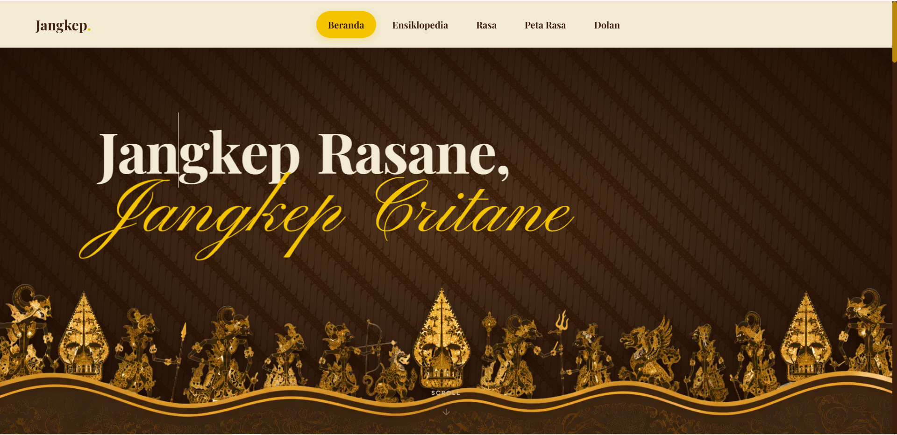
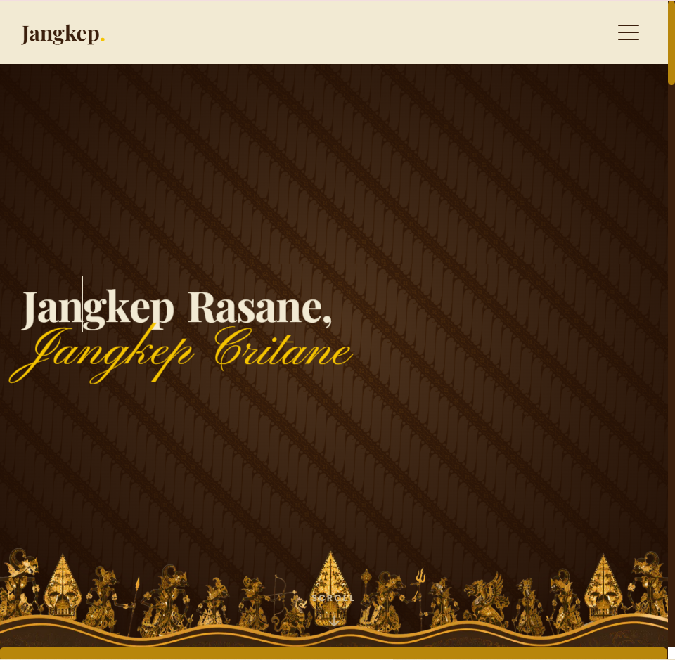
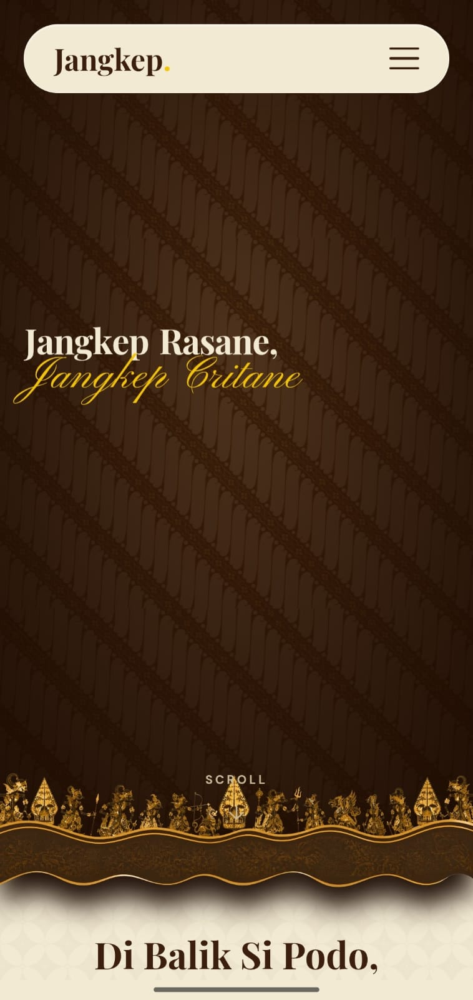

<div align="center">
  
  
  # Jangkep: Jangkep Rasane, Jangkep Critane
  
  *Website eksplorasi kuliner Jawa Tengah yang imersif, interaktif, dan edukatif.*

  **[Kunjungi Website Jangkep Live!](https://jangkep.vercel.app)**
</div>

---

## Tim Pengembang
Proyek ini dikembangkan oleh kelompok mahasiswa kelas **3SI1**:

| Nama Lengkap | NIM | Kelas |
| :--- | :--- | :--- |
| **M Rezky Raya Kilwouw** | 222313190 | 3SI1 |
| **Rifqi Muhadzib Ahdan** | 222313350 | 3SI1 |
| **Safira Inayah** | 222313365 | 3SI1 |

---

## Alasan Memilih Jawa Tengah
Jawa Tengah memiliki kekayaan kuliner peninggalan leluhur yang luar biasa, mulai dari keberagaman rasa (manis, gurih, pedas), filosofi mendalam di balik cara memasaknya, hingga akulturasi budaya. Sayangnya, dokumentasi kekayaan ini seringkali disajikan dengan kaku. Melalui **Jangkep**, kami ingin mengangkat derajat kuliner tradisional Jawa Tengah dengan balutan teknologi web modern (seperti efek paralaks, *scroll-telling*, dan gamifikasi), sehingga warisan kuliner Nusantara ini dapat dinikmati dan dipelajari oleh generasi muda dengan cara yang menyenangkan.

---

## Cara Instalasi Web

Ikuti langkah-langkah di bawah ini untuk menjalankan proyek Jangkep di komputer lokal Anda:

1. **Clone Repositori**
   ```bash
   git clone https://github.com/RifqiMuhA/jangkep.git
   cd jangkep
   ```

2. **Instalasi Dependensi**
   Pastikan Anda sudah menginstal [Node.js](https://nodejs.org/). Kemudian jalankan perintah berikut di terminal:
   ```bash
   npm install
   ```

3. **Jalankan Server Development**
   ```bash
   npm run dev
   ```

4. **Buka di Browser**
   Buka web browser Anda dan kunjungi `http://localhost:3000` untuk melihat dan berinteraksi dengan aplikasi.

---

## Cuplikan Layar (Screenshots)

Berikut adalah contoh tampilan antarmuka website **Jangkep** di berbagai ukuran layar:

### Tampilan Desktop


### Tampilan Tablet


### Tampilan Handphone (Mobile)


---

## Teknologi yang Digunakan
- **Framework Utama**: [Next.js](https://nextjs.org/) (React) dengan TypeScript
- **Styling**: Vanilla CSS & CSS Modules (Desain Kustom dengan tema khas Jawa/Batik)
- **Animasi & Interaksi**: 
  - [Framer Motion](https://www.framer.com/motion/) (Animasi layout dan gesture)
  - [GSAP](https://gsap.com/) (Animasi ScrollTrigger kompleks)
  - Lenis / Locomotive (Smooth Scrolling)
- **Fitur Spesial**: 
  - `react-pageflip` (Untuk interaksi buku resep manuskrip kuno 3D)
  - `@hello-pangea/dnd` (Untuk *Drag-and-Drop* mini-game racik bumbu)

## Fitur Unggulan
- **Ensiklopedia Kuliner**: Katalog kuliner interaktif yang dilengkapi filter visual kategori dan rasa.
- **Buku Resep Manuskrip**: Pengalaman imersif membalik halaman buku resep secara realistis dari kiri ke kanan.
- **Sejarah (*Scroll-Telling*)**: Cerita sejarah makanan yang dikemas dalam bentuk animasi horizontal dengan latar belakang wayang.
- **Game Meracik Masakan (*Dolan*)**: Mini-game interaktif (*drag-and-drop*) meracik bumbu ke dalam wajan yang dilengkapi animasi pantulan dan taburan bumbu.
